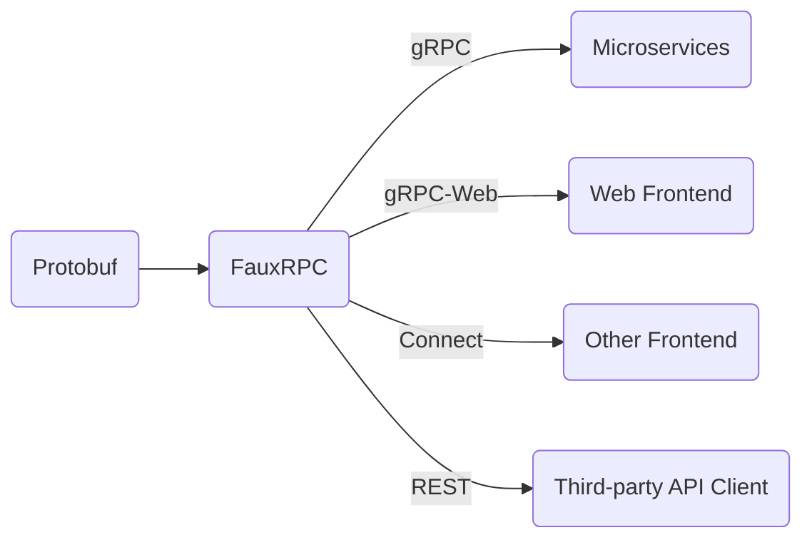

# FauxRPC

Quickly and easily set up a mock gRPC/gRPC-Web/Connect/Protobuf-powered REST API that returns random test data. No complicated code generation step, just pass the protobuf descriptors and go!



### Mock out services from descriptors
Now you can use protobuf descriptors to automatically make a fake API:
```shell
$ buf build buf.build/bufbuild/registry -o descriptors.binpb
$ go run ./cmd/fauxrpc/ run --schema=descriptors.binpb
```

### Mock out services using reflection
Use the reflection API to fake another gRPC server(s).
```shell
$ go run ./cmd/fauxrpc/ run --schema=https://demo.connectrpc.com
2024/08/15 19:10:01 INFO add file name=connectrpc.eliza.v1 path=connectrpc/eliza/v1/eliza.proto
2024/08/15 19:10:01 INFO Listening on http://127.0.0.1:6660
2024/08/15 19:10:01 INFO See available methods: buf curl --http2-prior-knowledge http://127.0.0.1:6660 --list-methods

# (in another shell) List out methods
$ buf curl --http2-prior-knowledge http://127.0.0.1:6660 --list-methods
connectrpc.eliza.v1.ElizaService/Converse
connectrpc.eliza.v1.ElizaService/Introduce
connectrpc.eliza.v1.ElizaService/Say

# Make a request! (connect)
$ buf curl --http2-prior-knowledge http://127.0.0.1:6660/connectrpc.eliza.v1.ElizaService/Say
{
  "sentence": "Mollitia ratione ea modi libero corrupti minus qui autem et."
}

# Make a request with gRPC-Web
$ buf curl --http2-prior-knowledge --protocol=grpcweb http://127.0.0.1:6660/connectrpc.eliza.v1.ElizaService/Say
{
  "sentence": "Eos illum consequatur adipisci eum et voluptatum quas id consequatur."
}

# Make a request with gRPC-Web
$ buf curl --http2-prior-knowledge --protocol=grpc http://127.0.0.1:6660/connectrpc.eliza.v1.ElizaService/Say
{
  "sentence": "Autem voluptatem quam aut ipsam voluptatem velit architecto ducimus quibusdam."
}
```

### Support for many different descriptors from different sources

This shows using descriptors from a file and from server reflection:
```shell
$ go run ./cmd/fauxrpc/ run --schema=descriptors.binpb --schema=https://demo.connectrpc.com
```

## Status: SUPER Alpha
This project is just starting out. I plan to add a lot of things that make this tool actually usable in more situations.

- Use known `protovalidate` rules to determine how to generate output.
- Service for adding/updating/removing stub responses.
- Configuration file
- BSR Support (maybe, using `buf build` to emit descriptors works well enough IMO)
- Templating for stub responses, maybe give the option to use values from the input in the output
- Heuristics "firstName" should probably generate first names, etc.
- Testing for REST translations. I have no idea if this actually works
- Streaming support
- Allow proto files as input?
